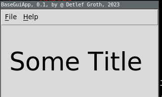

[](https://github.com/mittelmark/oowidgets/blob/main/LICENSE)
[](https://github.com/mittelmark/oowidgets/releases)


# oowidgets

Package for creating megawidgets using TclOO (WIP).

**Files:**

- [oowidgets/oowidgets.tcl](oowidgets/oowidgets.tcl) - implementation
- [oowidgets/pkgIndex.tcl](oowidgets/pkgIndex.tcl) - the package file
- [samples/flash.tcl](samples/flash.tcl) - some sample code to create widgets

**Links:**

- [Tutorial](https://htmlpreview.github.io/?https://raw.githubusercontent.com/mittelmark/oowidgets/master/tutorial.html)
- [Manual](https://htmlpreview.github.io/?https://raw.githubusercontent.com/mittelmark/oowidgets/master/oowidgets/oowidgets.html)
- [Download](https://github.com/mittelmark/oowidgets/archive/refs/heads/main.zip)
- [Wiki](https://wiki.tcl-lang.org/page/oowidgets)

**Usage:**

```
oowidgets::widget CLASSNAME CODE
```

This will create a command classname where all letters are lower case. The
classname must have at least one uppercase letter to distinguish it from the
Tcl command name. Here an example:

```
package require oowidgets
namespace eval ::flash { }
oowidgets::widget ::flash::Label {
    constructor {path args} {
        my install ttk::label $path -flashtime 200
        my configure {*}$args
    }
    method flash {} {
        set fg [my cget -foreground]
        for {set i 0} {$i < 10} {incr i} {
            my configure -foreground blue
            update idletasks
            after [my cget -flashtime]
            my configure -foreground $fg
            update idletasks
            after [my cget -flashtime]
        }
    }
}
```

This widget can be then used for instance like this:

```
set fl [flash::label .fl -text "FlashLabel" -flashtime 50 -anchor center]
pack $fl -side top -padx 10 -pady 10 -fill both -expand true
$fl flash
```

For more examples, including creating composite widgets, using mixins, see the [tutorial](https://htmlpreview.github.io/?https://raw.githubusercontent.com/mittelmark/oowidgets/master/tutorial.html)

There is a sample project which uses `TclOO` and `oowidgets` to create mega widgets. Here two example commands:

- [paul::basegui :blue_book:](https://htmlpreview.github.io/?https://raw.githubusercontent.com/mittelmark/oowidgets/master/paul/basegui.html) - base class to build Tk applications, [code](paul/basegui.tcl) 
- [paul::dlabel :blue_book:](https://htmlpreview.github.io/?https://raw.githubusercontent.com/mittelmark/oowidgets/master/paul/dlabel.html) - using inheritance to create changed `ttk::label` with dynamic fontsize,
   [code](paul/dlabel.tcl) 
- [paul::rotext :blue_book:](https://htmlpreview.github.io/?https://raw.githubusercontent.com/mittelmark/oowidgets/master/paul/rotext.html) - read only text widget, useful for help pages for instance
   [code](paul/rotext.tcl) 
- [paul::statusbar :blue_book:](https://htmlpreview.github.io/?https://raw.githubusercontent.com/mittelmark/oowidgets/master/paul/statusbar.html) - composite widget based on a `ttk::frame`, a `ttk::label` and a `ttk::progessbar`,  
   [code](paul/statusbar.tcl) 
- [paul::txmixins :blue_book:](https://htmlpreview.github.io/?https://raw.githubusercontent.com/mittelmark/oowidgets/master/paul/txmixins.html) - mixin classes for the `tk::text` widget to extend its functions,  
   [code](paul/txmixins.tcl) 

PS: package name inspired by some wiki code about creating megawidgets with TclOO from which a lot of code was "stolen"..

**License:** BSD

**Snit vs oowidgets**

Here an example widget ins snit, the above mentioned `dlabel` a `ttk::label` with dynamic font-size adaptation, looks like this:



Here the snit code:

```{.tcl}
package require snit
namespace eval dgw { }
snit::widget  dgw::dlabel {
    component label
    option -text "Default"
    delegate method * to label
    delegate option * to label
    option -font ""
    constructor {args} {
        install label using ttk::label $win.lbl {*}$args
        $self configurelist $args
        if {$options(-font) eq ""} {
            set mfont [font create {*}[font configure TkDefaultFont]]
            $label configure -font $mfont
            set options(-font) $mfont
        }
        pack $label -side top -fill both -expand yes -padx 10 -pady 10
        bind  $label <Configure> [mymethod ConfigureBinding %W %w %h] 
    }
    method AdjustFont {width height} {
        set cw [font measure $options(-font) $options(-text)]
        set ch [font metrics $options(-font)]
        set size [font configure $options(-font) -size]
        # shrink
        set shrink false
        while {true} {
            set cw [font measure $options(-font) $options(-text)]
            set ch [font metrics $options(-font)]
            set size [font configure $options(-font) -size]

            if {$cw < $width && $ch < $height} {
                break
            }
            incr size -2
            font configure $options(-font) -size $size
            set shrink true
        }
        # grow
        while {!$shrink} {
            set cw [font measure $options(-font) $options(-text)]
            set ch [font metrics $options(-font)]
            set size [font configure $options(-font) -size]
            if {$cw > $width || $ch > $height} {
                incr size -2 ;#set back
                font configure $options(-font) -size $size
                break
            }
            incr size 2
            font configure $options(-font) -size $size
        }
    }
    
    method ConfigureBinding {mwin width height} {
        bind $mwin <Configure> {}
        $self AdjustFont $width $height
        after idle [list bind $mwin <Configure> [mymethod ConfigureBinding %W %w %h]]
    }
}
```

And here the oowidget code:

```{.tcl}
package require oowidgets
namespace eval paul { }

oowidgets::widget ::paul::Dlabel {
    variable label
    constructor {path args} {
        my install ttk::label $path \
              -font [font create {*}[font configure TkDefaultFont]] \
              -text Default
        my configure {*}$args
        set label $path
        bind  $label <Configure> [callback ConfigureBinding %W %w %h] 
    }
    method AdjustFont {width height} {
        set cw [font measure [my cget -font] [my cget -text]]
        set ch [font metrics [my cget -font]]
        set size [font configure [my cget -font] -size]
        # shrink
        set shrink false
        while {true} {
            set cw [font measure [my cget -font] [my cget -text]]
            set ch [font metrics [my cget -font]]
            set size [font configure [my cget -font] -size]

            if {$cw < $width && $ch < $height} {
                break
            }
            incr size -2
            font configure [my cget -font] -size $size
            set shrink true
        }
        # grow
        while {!$shrink} {
            set cw [font measure [my cget -font] [my cget -text]]
            set ch [font metrics [my cget -font]]
            set size [font configure [my cget -font] -size]
            if {$cw > $width || $ch > $height} {
                incr size -2 ;#set back
                font configure [my cget -font] -size $size
                break
            }
            incr size 2
            font configure [my cget -font] -size $size
        }
    }
    method ConfigureBinding {mwin width height} {
        bind $mwin <Configure> {}
        my AdjustFont $width $height
        after idle [list bind $mwin <Configure> [callback ConfigureBinding %W %w %h]]
    }
}

```

The main differences using `oowidgets`:

- no hull widget, just direct install of ttk::label without a frame
- snit: `$self configurelist $args` - `oowidgets: `my configure {*}$args`
- all methods and options are automatically delegated to this main widget if there is no hull widget
- not `mymethod` but the `callback` method suggested in [Tclers Wiki](https://wiki.tcl-lang.org/page/TclOO+Tricks)
- not using an options array but `my cget`

Let's give an other example, the famous readonly text widget, 
[here the snitcode](https://wiki.tcl-lang.org/page/Snit%27s+Not+Incr+Tcl) 
from the dark old times when no OOP was in the Tcl core reimplemented with oowidgets:

```{.tcl}
package require oowidgets
namespace eval ::test { }
::oowidgets::widget ::test::Rotext {
    variable textw
    constructor {path args} {
        # we need the real widget (underline at the end)
        set textw ${path}_
        # Create the text widget; turn off its insert cursor
        my install tk::text $path -insertwidth 0 -border 5 -relief flat
        my configure {*}$args
    }
    # Disable the text widget's insert and delete methods
    # to make this readonly even if the user writes text.
    method insert {args} { } 
    method delete {args} { }
    # programmatically we can still insert and delete ...
    method ins {args} { $textw insert {*}$args  }
    method del {args} { $textw delete {*}$args  }
}
```

## CHANGES

- 2024-12-29 : 0.4.0 Making it Tcl 9 ready

## TODO's

- delegate method?
- component declaration?
- snit compatibility?
- Tcl 9 check (done)
