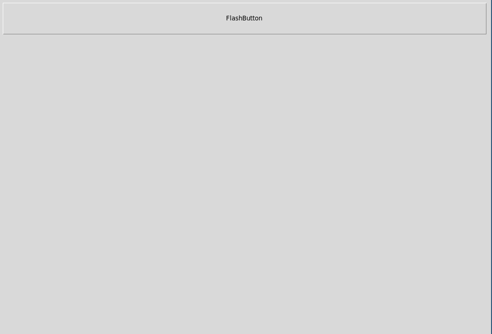

## Table of Contents

- [Introduction](#intro)
- [Inheritance](#inheritance)
- [Options](#options)
- [Mixins](#mixins)
- [Composition](#composition)

## <a name="intro"> Introduction</a>

This is a short tutorial on how to use the packages `oowidgets` and `tkoo` to
create megawidgets using techniques like inheritance, mixins or composition.
It is based on the package TclOO which is in the core since Tcl 8.6 so, this
is the minimal requirement.


### Package loading

Let's first load the package:

```{.tcl echo=false results="hide"}
### just for recording setup
after 2500
```

```{.tcl}
lappend auto_path .
package require oowidgets
puts [package present oowidgets]
```

Once the package is loaded we can start with a few examples.

## <a name="inheritance"> Inheritance</a>

If we think about object oriented programming the first mechanism to learn is
usually _inheritance_. Let's use this mechanism and create an extended version
of a `ttk::button` which has as well a flash function. We use the method
`oowidgets::widget` to create a new class and a Tk command for this widget.
Please note that the classname must contain at least one uppercase character
to not interfere with the created Tk command which will be all lowercase.

Here is our code:

```{.tcl}
namespace eval ::flash {}
oowidgets::widget ::flash::Button {
    constructor {path args} {
          my install ttk::button $path -flashtime 200
          my configure {*}$args
    }
    method flash {} {
        set ot [my cget -text]
        set ft [my cget -flashtime]
        for {set i 0} {$i < 5} {incr i} {
            my configure -text "......"
            update idletasks
            after $ft
            my configure -text $ot
            update idletasks
            after $ft
        }
        puts flashed
        my configure -text $ot
    }
}
```

This creates the class `::flash::Button` and a Tk widget command `::flash::button` which
should be used to create the widget. In the constructor we as well add a new
configuration option `-flashtime` with a default value of 200. Let's inspect
the command created in the `::flash` namespace:

```{.tcl}
puts [info commands ::flash::*]
```

We can now use the command `::flash::button` the same way we would use the
`ttk::button`, our new command however has now as well the flash method:

```{.tcl}
set fb [flash::button .fb -flashtime 100 -width 200 \
    -text "FlashButton" \
    -command { puts "I am a flash::button" }]
pack $fb -side top -padx 10 -pady 10 -ipady 20 -ipadx 20
$fb flash
```

The options `-flashtime` is a new option which we added in our constructor of
the `flash::Button` class.

As we use here public inheritance we can still use all the default
`ttk::button` methods for instance a method like `invoke` and due to a
renaming trick we can as well call the methods using the widget path:

```{.tcl}
### using variable
$fb invoke
#### using widget path
.fb invoke
```

Let's say we would like to extend the `flash::button` widget even further and
we would like to inherit now from its class, `flash::Button`, we could do this
like this:

```{.tcl}
oowidgets::widget ::flash::GreetButton {
   superclass ::flash::Button
   method greet {{message "Hello"}} {
      puts $message
   }
}
puts [info commands ::flash::*]
```

As you can see we have now the new class and the new command in our `::flash`
namespace.

Please note that the superclass statement must be the very first on our widget
definition code.

We can now use this widget the same way like the `flash::button` widget:

```{.tcl}
set gb [flash::greetbutton .gb -text "Greeter"]
pack $gb -fill x -side top -padx 10 -pady 10 -ipady 20 -ipadx 20
$gb flash
$gb greet "Greetings from the greetbutton!"
```

The approach we used until now can be as well called **public inheritance**.
Our new widgets expose all commands of the widgets from which they are
derived. Sometimes you however you like to use **private inheritance** were
you would like to expose only a limited amount of functionality of the
underlying widget. You can achieve this by overwriting the `unknown` method to
create an error in your new class. Do give an example we create a create a
class ::flash::FlashButton  which only has the flash, configure and cget
methods but not anymore the invoke method of the standard `ttk::button`:

```{.tcl}
oowidgets::widget ::flash::FlashButton {
    constructor {path args} {
        ttk::style layout FlashButton [ttk::style layout TButton]
        ttk::style configure FlashButton -anchor center
        my install ttk::button $path -flashtime 100 \
             -text [string repeat "\u2588" 10] -style FlashButton
        my configure {*}$args
    }
    method unknown {method args} {
        return -code error "Method $method not implemented! Valid methods are [info class methods ::flash::FlashButton -all]!"
    }
    # hide unknown method to disallow outside use
    unexport unknown
    method flash {} {
        set fg black
        set ft [my cget -flashtime]
        for {set i 0} {$i < 5} {incr i} {
            ttk::style configure FlashButton -foreground red
            update idletasks
            after $ft
            ttk::style configure FlashButton -foreground $fg
            update idletasks
            after $ft
        }
        puts "flashbutton was flashed"
    }
}
puts [info commands ::flash::*]
```        

Let's now use this `flashbutton` widget:

```{.tcl}
set fl [flash::flashbutton .fl -flashtime 200]
pack $fl -side top -padx 10 -pady 10 -ipady 20 -ipadx 20
$fl configure -command { puts Hi }
$fl flash
```

```{.tcl}
catch {$fl invoke}
puts "$errorInfo"
```

To remove as well `configure`,  `cget` and the methods which will be explained
later, you could  create two methods of that name which does  nothing and then
unexport them as you see with the `unknown` method.

## <a name="options">Options</a>

Options are widget  specific  public  variables which are usually set with the
`configure`  and `cget`  methods  of a widget.  There are  currently  two basic
possibilities  to define such options,  either by using the option  method for
the current  class or by adding  these  options as key value  arguments to the
install method. This is usually done within the  constructor.  Here an example
for a derived  button class which has the options  -flashtime and  -flashcolor
with default values.


```{.tcl}
oowidgets::widget ::flash::BlueFlashButton {
    constructor {path args} {
        my option -flashtime 200
        my option -flashcolor blue
        ttk::style layout FlashButton [ttk::style layout TButton]
        ttk::style configure FlashButton -anchor center
        my install ttk::button $path \
             -text [string repeat "\u2588" 10] -style FlashButton
        my configure {*}$args
    }
    method flash {} {
        set fg black
        set ft [my cget -flashtime]
        for {set i 0} {$i < 5} {incr i} {
            ttk::style configure FlashButton -foreground [my cget -flashcolor]
            update idletasks
            after $ft
            ttk::style configure FlashButton -foreground $fg
            update idletasks
            after $ft
        }
        puts "The blue flashbutton was flashed for [my cget -flashtime] milliseconds!"
    }
}
puts [info commands ::flash::*]
```        

Let's now use this `blueflashbutton` widget:

```{.tcl}
set bfl [flash::blueflashbutton .bfl -flashtime 500]
pack $bfl -side top -padx 10 -pady 10 -ipady 20 -ipadx 20
$bfl configure -command { puts Hi }
$bfl flash
puts [$bfl cget -flashtime]
puts [$bfl cget -flashcolor]
```

If you chose  either the `my option key value` or the `my  install  basewidget -key value`
approach  is up to you.  Usually  with  many  options  to make  the code  more
readable and to annotate the options with comments and  documentation  the `my
option key value` approach seems more feasible.

## <a name="mixins">Mixins</a>

An alternative to the above shown inheritance approach is the creation of mixins. Whereas
inheritance often leads to large and complex hierarchies, mixins add some
required functionality on the fly without the need to extend a base class. This
approach is more flexible, just add the required mixin classes to get some
desired additional behaviour of your widget. In the following we will create a mixin class `mx::Flash`
which can flash Labels, Text widgets and Buttons. We will then add this behaviour to
our classes just easily.

Here our class which as a mixin is not a widget usable by itself and should be
not instantiated as an object on its own:

```{.tcl}
namespace eval ::mx { }

oo::class create ::mx::Flash {
    method flash {{flashtime 200}} {
        
        set cls  [my tkclass]
        if {$cls eq "TButton"} {
            set txt [my cget -text]
            for {set i 0} {$i < 5} {incr i} {
                my configure -text [string repeat "-" [string length $txt]]
                update idletasks
                after $flashtime
                my configure -text $txt
    
                update idletasks
                after $flashtime
            }   

        } elseif {$cls in [list "Text" "TLabel"]} {
            set fg [my cget -foreground]
            for {set i 0} {$i < 5} {incr i} {
                my configure -foreground salmon
                update idletasks
                after $flashtime
                my configure -foreground $fg
                update idletasks
                after $flashtime
            }   
        }   
        puts "flashing $flashtime long"
    }
}
```

To add a mixin to a Tk widget we need first to create a proxy  class  which is
nothing more than the original  widget  without any  additions.  The reason we
need to do that is that Tk and Ttk  widgets are not TclOO  objects so we create
wrapper  classes  which  will  embed  these base  widgets.  Here are two proxy
classes:

```{.tcl}
oowidgets::widget ::mx::Button {
    constructor {path args} {
        my install ttk::button $path
        my configure {*}$args
    }
}
oowidgets::widget ::mx::Label {
    constructor {path args} {
        my install ttk::label $path
        my configure {*}$args
    }
}
puts [lsort [info command ::mx::*]]
```

Once this is done we can add to our  classes  the mixin  using the Tcl command
[oo::define](https://www.tcl-lang.org/man/tcl/TclCmd/define.htm)  to add  this
flash method directly to the class:

```{.tcl}
oo::define ::mx::Button { mixin ::mx::Flash }
oo::define ::mx::Label { mixin ::mx::Flash }
puts [info class methods ::mx::Button -all]
set mxb [::mx::button .mxb -text "Hello ::mx::button"]
set mxl [::mx::label .mxl -text "Hello ::mx::Label" -anchor center]
pack $mxb -side top -fill x -padx 10 -pady 10 -ipadx 5 -ipady 5
pack $mxl -side top -fill x -padx 10 -pady 10 -ipadx 5 -ipady 5
update idletasks
$mxb flash 400
$mxl flash 100
```

Instead  of adding  the  method to the class we could as well add the mixin to
the   created    objects    like   `$mxb`   and   and   `$mxl`,    using   the
[oo::objdefine](https://www.tcl-lang.org/man/tcl/TclCmd/define.htm) method.

The  advantage  of this  approach  is  obvious:  instead of  creating  complex
inheritance hierarchies we just create classes with some desired functionality
and attach them to our widgets if we need. As the  declaration  of these proxy
classes is slightly tedious and cumbersome,
there  exists already a namespace  which  contains the proxy  classes for all
standard Ttk or Tk widgets in case when no ttk widget is available.  They can
be all loaded using a `package require tkoo`:

```{.tcl}
package require tkoo
puts [lsort [info procs ::tkoo::*]]
```

Let's  add  the  ::mx::Flash  class  to a  text  widget  here  now  using  the
`oo::objdefine` command:

```{.tcl}
set txt [tkoo::text .txt]
oo::objdefine $txt mixin ::mx::Flash
$txt insert end "Hello this is some text\nWhich is inserted!"
pack $txt -side top -fill x -padx 10 -pady 10 -ipadx 5 -ipady 5
$txt flash
### let's display the methods
puts [info object methods $txt -all]
```

Below you see the executed code:



We can add as well add more than one mixin. Let's create a mixin class _mx::Lipsum_ which returns lipsum text.

```{.tcl}
oo::class create ::mx::Lipsum {
    method lipsum {{n 1}} {
        return [string repeat [regsub -all {^ +} {
            Lorem ipsum dolor sit amet, consetetur sadipscing elitr,
            sed diam nonumy eirmod tempor invidunt ut labore et dolore magna aliquyam erat,
            sed diam voluptua. At vero eos et accusam et justo duo dolores et ea rebum. 
            Stet clita kasd gubergren, no sea takimata sanctus est Lorem ipsum dolor sit amet.
        }] $n]    
    }
}   
oo::objdefine $txt mixin -append ::mx::Lipsum 
puts [info object methods $txt -all]
```

Adding mixins that way via  `oo::objdefine` is a little bit tedious. So there was a
method  `mixin` added  directly to the  `::oowidgets::BaseWidget`  class which
from which every  `oowidget` is inheriting.  Here an example how we can extend
the `tkoo::treeview` widget by two mixin classes with one command line call.

```{.tcl}
package require paul
proc onClick {fname} {
  puts "Clicked $fname"
}
set tv [tkoo::treeview .tv]
$tv mixin paul::tvfilebrowser -browsecmd onClick paul::tvksearch
pack $tv -side top -fill both -expand yes
puts [info object methods $tv -all]
puts [info object mixins $tv]
```

The  `mixin`  method of the  `oowidgets::BaseWidget`  class  offers as well an
additional advantage. Mixin classes do not automatically call the constructor.
However  sometimes we would like to  initialize a few variables for the mixin.
So the mixin method of the  ``oowidgets::BaseWidget`  class looks for a method
with the same name as the widget and the automatically  calls this method with
the options  giving at the  constructor  call. Here an example for  treewidget
which has stripes and is sortable by clicking on the column headers:

```{.tcl eval=true}
tkoo::treeview .tvs -columns [list A B C] -show headings
.tvs mixin paul::tvband -bandcolors [list #FFFFFF #FFCCCC] paul::tvsortable -sorttypes [list A real B real C integer]
foreach col [list A B C] { .tvs heading $col -text $col }
for {set i 0} {$i < 20} {incr i 1} {
   .tvs insert {} end -values [list  [expr {int(rand()*100)}] \
                   [expr {int(rand()*1000)}] [expr {int(rand()*1000)}]]
}
pack .tvs -side top -fill both -expand yes
puts [.tvs cget -bandcolors]
puts [info object methods .tvs -all]
```

The methods `tvband` and `tvsortable` are the methods of the mixins which were
called  automatically  be the `.tvs  mixin ...` call. To have a more  detailed
look how such mixins are defined look at the treeview  mixin source code here:
[tvmixins.tcl](paul/tvmixins.tcl).  To  look  at the  documentation  of  these
mixins                look                here                 
[paul::tvmixins](https://htmlpreview.github.io/?https://raw.githubusercontent.com/mittelmark/oowidgets/master/paul/tvmixins.html).

Let's finally add the lipsum method to the .tvs command using `oo::objdefine`:

```{.tcl eval=true}
oo::objdefine .tvs mixin mx::Lipsum
puts [info object methods .tvs -all]
puts [.tvs lipsum]
```


## <a name="composition">Composition</a>

If we speak about megawidgets we mean usually  that these are widgets which are
assembled out of several more basic widgets. A typical example is a `LabEntry` consisting
out of a Label and a Entry widget side by side which are usually arranged
using a frame, so something like this:


Let's create for illustrative purposes such a `labentry` widget. We will place
it as well in a new namespace:

```{.tcl}
namespace eval ::comp { }
oowidgets::widget ::comp::LabEntry {
    variable ent
    variable lab
    constructor {path args} {
        # the main widget is the frame
        # add an additional label
        my install ttk::frame $path
        set lab [ttk::label $path.lab]
        set ent [ttk::entry $path.ent]
        pack $lab -side left -padx 5 -pady 5
        pack $ent -side left -padx 5 -pady 5
        my configure {*}$args
    }
    # expose the internal widgets using subcommands
    method label {args} {
        if {[llength $args] == 0} {
            return $lab
        }
        $lab {*}$args
    }
    method entry {args} {
        if {[llength $args] == 0} {
            return $ent
        }
        $ent {*}$args
    }
    # you could as well delegate all methods to the entry widget
    # making it your default widget
    method unknown {args} {
        $ent {*}$args
    } 
}

puts [info commands ::comp::*]
puts [info class methods ::comp::LabEntry -all]
```

Usually it is a good idea to place your widgets in a frame and arrange them
therein using your geometry manager like `pack` or `grid`. The you can decide
which methods of your widget to expose. In the example above all
methods of our internal widgets are exposed using the methods `entry` and `label`
which then forward the arguments to the right internal widget. If no method is given to these
commands just the internal widget is returned. 

```{.tcl}
set lent [::comp::labentry .lentry]
pack $lent -side top -padx 10 -pady 20
$lent label configure -text "Label: "
$lent entry insert 0 "Some text"
puts [$lent entry]
bind [$lent entry] <Destroy> { puts "destroyed entry" }
bind $lent <Destroy> { puts "destroyed labentry" }
destroy $lent
```

If you like to create new options like `-labeltext` you should create a new
configure method in your class where you then delegate this option to the right widget. That could look something like this:

```{.tcl eval=false}
oowidgets::widget ::paul::LabEntry {
    variable ent
    variable lab
    constructor {path args} {
        ### initialize with option -labeltext, defaults empty string
        my install ttk::frame $path -labeltext ""
        .... code like before
    }
    ... methods like before
    method configure {args} {
       next {*}$args
       my label configure -text [my cget -labeltext]
    }    
}
```

This can however soon become complex with more options, so you have to update the configuration
settings for the class if configure is called via `obj label configure`. So
probably it is the easiest way to leave it as it it is and then update the
component configurations via the exposed commands `label` and `entry`. This
then needs however separate calls for intialization of the main widget and
then initialization of the components.

```{.tcl echo=false results="hide"}
after 2000 exit
```

## Document generation

This            document            was            generated             using
[pantcl](https://github.com/mittelmark/pantcl) on 
`.tcl clock format [clock seconds] -format %Y-%m-%d`.


See the [Makefile](Makefile) for the used commands.

## Author

Detlef Groth, University of Potsdam, Germany


