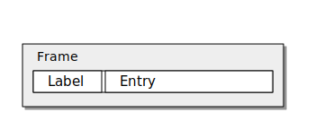

## Introduction

This is a short tutorial on how to use the packages `oowidgets` and `tkoo` to create
megawidgets using techniques like inheritance, mixins or composition.

Let's first load the package:

## Package loading

```{.tcl echo=false results="hide"}
### just for recording setup
after 500
```

```{.tcl}
lappend auto_path .
package require oowidgets
puts [package present oowidgets]
```

Once the package is loaded we can start with a few examples.

## Inheritance

If we think about object oriented programming the first mechanism to learn is
usually _inheritance_. Let's use this mechanism and create an extended version
of a `ttk::button` which has as well a flash function. We use the method
`oowidgets::widget` to create a new class and a Tcl command for this widget.
Please note that the classname must contain at least one uppercase character
to not interfere with the created Tcl command which will be all lowercase.

Here our code:

```{.tcl}
after 2000
namespace eval ::flash {}
oowidgets::widget ::flash::Button {
    constructor {path args} {
          my install ttk::button $path -flashtime 200
          my configure {*}$args
    }
    method flash {} {
        set ot [my cget -text]
        set ft [my cget -flashtime]
        for {set i 0} {$i < 5} {incr i} {
            my configure -text "......"
            update idletasks
            after $ft
            my configure -text $ot
            update idletasks
            after $ft
        }
        puts flashed
        my configure -text $ot
    }
}
```

This creates the class `::flash::Button` and a command `::flash::button` which
should be used to create the widget. In the constructor we as well add a new
configuration option `-flashtime` with a default value of 200. Let's inspect
the command created in the `::flash` namespace:

```{.tcl}
puts [info commands ::flash::*]
```

We can now use the command `::flash::button` the same way we would use the
`ttk::button`, our new command however has now as well the flash method:

```{.tcl}
set fb [flash::button .fb -flashtime 100 -width 200 \
    -text "FlashButton" \
    -command { puts "I am a flash::button" }]
pack $fb -side top -padx 10 -pady 10 -ipady 20 -ipadx 20
$fb flash
```

The options `-flashtime` is a new option which we added in our constructor of
the `flash::Button` class.

As we use here public inheritance we can still use all the default
`ttk::button` methods for instance a method like `invoke` and due to a
renaming trick we can as well call the methods using the widget path:

```{.tcl}
### using variable
$fb invoke
#### using widget path
.fb invoke
```

Let's say we would like to extend the `flash::button` widget even further and
we would like to inherit now from its class, `flash::Button`, we could do this
like this:

```{.tcl}
oowidgets::widget ::flash::GreetButton {
   superclass ::flash::Button
   method greet {{message "Hello"}} {
      puts $message
   }
}
puts [info commands ::flash::*]
```

As you can see we have now the new class and the new command in our `::flash`
namespace.

Please note that the superclass statement must be the very first on our widget
definition code.

We can now use this widget the same way like the `flash::button` widget:

```{.tcl}
set gb [flash::greetbutton .gb -text "Greeter"]
pack $gb -fill x -side top -padx 10 -pady 10 -ipady 20 -ipadx 20
$gb flash
$gb greet "Greetings from the greetbutton!"
```

The approach we used until now can be as well called **public inheritance**.
Our new widgets expose all commands of the widgets from which they are
derived. Sometimes you however you like to use **private inheritance** were
you would like to expose only an limited amount of functionality of the
underlying widget. You can achieve this by overwriting the `unknown` method to
create an error in your new class. Do give an example we create a create a
class ::flash::FlashButton  which only has the flash, configure and cget
methods but not anymore the invoke method of the standard `ttk::button`:

```{.tcl}
oowidgets::widget ::flash::FlashButton {
    constructor {path args} {
        ttk::style layout FlashButton [ttk::style layout TButton]
        ttk::style configure FlashButton -anchor center
        my install ttk::button $path -flashtime 100 \
             -text [string repeat "\u2588" 10] -style FlashButton
        my configure {*}$args
    }
    method unknown {method args} {
        return -code error "Method $method not implemented! Valid methods are [info class methods ::flash::FlashButton -all]!"
    }
    # hide unknown method to disallow outside use
    unexport unknown
    method flash {} {
        set fg black
        set ft [my cget -flashtime]
        for {set i 0} {$i < 5} {incr i} {
            ttk::style configure FlashButton -foreground red
            update idletasks
            after $ft
            ttk::style configure FlashButton -foreground $fg
            update idletasks
            after $ft
        }
        puts "flashbutton was flashed"
    }
}
puts [info commands ::flash::*]
```        

Let's now use this `flashbutton` widget:

```{.tcl}
set fl [flash::flashbutton .fl -flashtime 200]
pack $fl -side top -padx 10 -pady 10 -ipady 20 -ipadx 20
$fl configure -command { puts Hi }
$fl flash
```

```{.tcl}
catch {$fl invoke}
puts "$errorInfo"
```

To remove as well `configure` and `cget` you could create two methods of that
name which does nothing and then unexport them as you see with the `unknown` method.


## Mixins

An alternative to the shown approach above is the creation of mixins. Whereas
inheritance often leads to large and complex hierarchies, mixins add some
required functionality on the fly without the need to extend a base class. Ths
approach is more flexible, just add the required mixin classes to get some
desired behaviour. In the following we will create a mixin class `mx::Flash`
which can flash both Labels and Buttons. We will then add this behaviour to
our classes just easily.

Here our class which is not a widget usable by itself:

```{.tcl}
namespace eval ::mx { }

oo::class create ::mx::Flash {
    method flash {{flashtime 200}} {
        
        set cls  [my tkclass]
        if {$cls eq "TButton"} {
            set txt [my cget -text]
            for {set i 0} {$i < 5} {incr i} {
                my configure -text [string repeat "-" [string length $txt]]
                update idletasks
                after $flashtime
                my configure -text $txt
    
                update idletasks
                after $flashtime
            }   

        } elseif {$cls in [list "Text" "TLabel"]} {
            set fg [my cget -foreground]
            for {set i 0} {$i < 5} {incr i} {
                my configure -foreground salmon
                update idletasks
                after $flashtime
                my configure -foreground $fg
                update idletasks
                after $flashtime
            }   
        }   
        puts "flashing $flashtime long"
    }
}
```

To add a mixin to a Tk widget we need first to create a proxy class which is
nothing more than the original widget without any addtions. Here two proxy classes:

```{.tcl}
oowidgets::widget ::mx::Button {
    constructor {path args} {
        my install ttk::button $path
        my configure {*}$args
    }
}
oowidgets::widget ::mx::Label {
    constructor {path args} {
        my install ttk::label $path
        my configure {*}$args
    }
}
puts [lsort [info command ::mx::*]]
```

Once this is done we can add to our classes the mixin:

```{.tcl}
oo::define ::mx::Button { mixin ::mx::Flash }
oo::define ::mx::Label { mixin ::mx::Flash }
puts [info class methods ::mx::Button -all]
set mxb [::mx::button .mxb -text "Hello ::mx::button"]
set mxl [::mx::label .mxl -text "Hello ::mx::Label" -anchor center]
pack $mxb -side top -fill x -padx 10 -pady 10 -ipadx 5 -ipady 5
pack $mxl -side top -fill x -padx 10 -pady 10 -ipadx 5 -ipady 5
update idletasks
$mxb flash 400
$mxl flash 100
```

The advantage of this approach is obvious: instead of creating complex
hierarchies we just create classes with some desired functionality and attach
them to our widgets if we need. As the declaration of these proxy classes
there exists already a namespace which contains the proxy classes for all
standard ttk and tk widgets in case when no ttk widget is availble. They can be loaded using a `package require tkoo`:

```{.tcl}
package require tkoo
puts [lsort [info procs ::tkoo::*]]
```

Let's add the Flashing to a text widget:

```{.tcl}
set txt [tkoo::text .txt]
oo::define ::tkoo::Text { mixin ::mx::Flash }
$txt insert end "Hello this is some text\nWhich is inserted!"
pack $txt -side top -fill x -padx 10 -pady 10 -ipadx 5 -ipady 5
$txt flash
```

Below you see the executed code:


## Composition

If we think about megawidgets usually we mean that there are widgets which are
assembled out of several widgets. A typical example is a `LabEntry` consisting
out of a Label and a Entry widget side by side which are usually arranged
using a frame, so something like this:

```{.kroki dia="ditaa" echo=false cache=false results="hide"}

+----------------------------+
| Frame cEEE                 |
|+-------+------------------+|
|| Label | Entry            || 
|+-------+------------------+| 
+----------------------------+
```



Let's create for illustrative purposes such a LabEntry widget. We will place
it as well in a new namespace:

```{.tcl}
namespace eval ::comp { }
oowidgets::widget ::comp::LabEntry {
    variable ent
    variable lab
    constructor {path args} {
        # the main widget is the frame
        # add an additional label
        my install ttk::frame $path
        set lab [ttk::label $path.lab]
        set ent [ttk::entry $path.ent]
        pack $lab -side left -padx 5 -pady 5
        pack $ent -side left -padx 5 -pady 5
        my configure {*}$args
    }
    # expose the internal widgets using subcommands
    method label {args} {
        if {[llength $args] == 0} {
            return $lab
        }
        $lab {*}$args
    }
    method entry {args} {
        if {[llength $args] == 0} {
            return $ent
        }
        $ent {*}$args
    }
    # you could as well delegate all methods to the entry widget
    # making it your default widget
    method unknown {args} {
        $ent {*}$args
    } 
}

puts [info commands ::comp::*]
```

Usually it is a good idea to place your widgets in a frame and arrange them
therein using your geometry manager like `pack` or `grid`. The you can decide
which methods of your widget to expose. In the example above here are all
methods exposed using the methods `entry` and `label` which then forward the
arguments to the right internal widget. If no method is given to these
commands just the internal widget is returned. 

```{.tcl}
set lent [::comp::labentry .lentry]
pack $lent -side top -padx 10 -pady 20
$lent label configure -text "Label: "
$lent entry insert 0 "Some text"
puts [$lent entry]
bind [$lent entry] <Destroy> { puts "destroyed entry" }
bind $lent <Destroy> { puts "destroyed labentry" }
destroy $lent
```

If you like to create new options like `-labeltext` you should create a new
configure method in your class where you then delegate this option to the right widget. That could look something like this:

```{.tcl eval=false}

oo::define ::comp::LabEntry method configure {args} {
   next {*}$args
   my label configure -text [my cget -labeltext]
}
```

This can however soon become complex, so you have to update the configuration
settings for the class if configure is called via `obj label configure`. So
probably it is the easiest way to leave it as it it is and then update the
component configurations via the exposed commands `label` and `entry`. This
then needs however separate calls for intialization of the main widget and
then initialization of the components.

```{.tcl echo=false results="hide"}
after 2000 exit
```

## EOF


